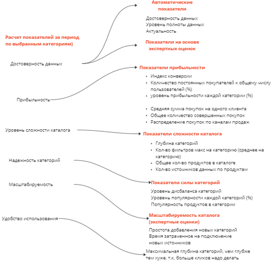
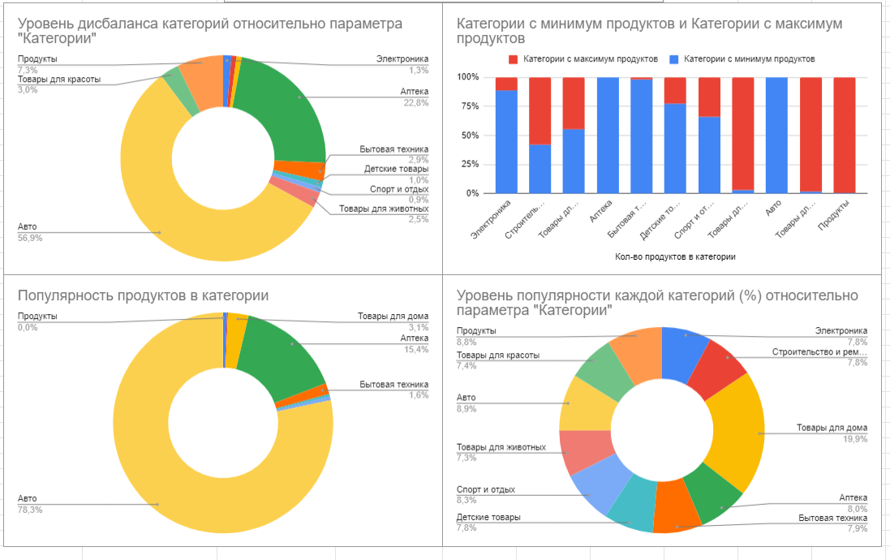
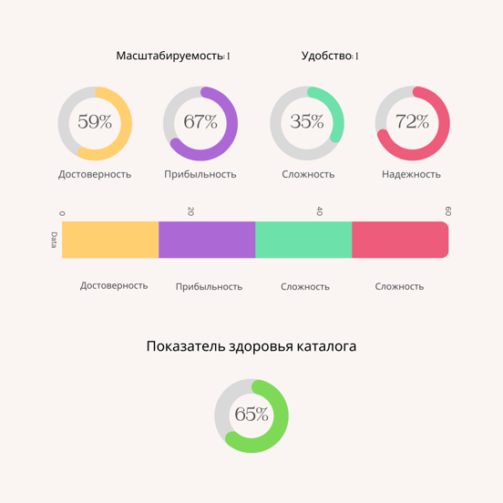

# Идеатон X-Mas Hack 2022
https://xmas-hack.ru

## Реализация единого агрегатора показателей цифрового каталога для финтех компаний
 
### Агрегированные показатели каталога
- Достоверность
- Прибыльность
- Уровень сложности каталога
- Надежность категорий
- Масштабируемость
- Удобство использования

### Показатели каталога
#### Достоверность данных

- Проверка корректности средствами Machine Learning (ML):
    - проверка значений через регрессионные и классификационные модели
    - проверка соответствия описания продукта изображению
- Выявление аномалий в данных с использованием ML и мат.методов
    - Проверка на орфографию и на дубликаты продуктов
- Уровень полноты данных :
    - дисбаланс категорий
    - заполненность атрибутов продуктов
- Актуальность:
    - время с последнего обновления продуктов 
    - время с последней верификации экспертами категорий каталога (экспертная оценка)

#### Прибыльность

- Индекс конверсии ([Формулы расчета индексов конверсии](https://miro.com/app/board/uXjVP5fL4as=/)) 
   - Конверсия пользователей в покупатели
   - Конверсии совершения покупки при заходе в категорию 
- Количество постоянных покупателей
- Уровень прибыльности каждой категории *
- Средняя сумма покупок на одного клиента
- Общее количество совершенных покупок по категориям
- Распределение покупок по каналам продаж

#### Уровень сложности каталога
- Глубина категорий
- Количество фильтров на категорию
- Общее количество продуктов в каталоге
- Количество источников данных по продуктам
  
#### Надежность категорий
- Уровень дисбаланса категорий - расчет дисбаланса для каждой категории
- Уровень популярности каждой категорий (%)
- Популярность продуктов в категории - отношение популярности категории к кол-ву продуктов в категории
- Пример расчета показателя надежности: [GDocs](https://docs.google.com/spreadsheets/d/1Pw9Y7kyLDNNiFPy-4QR16IG3eYHnIljKwIokm4qwnn4/edit#gid=0)

#### Масштабируемость каталога
- Простота добавления новых категорий (экспертные оценки)
   - Затраченное общее время на добавление новой категории (час)
   - Время затраченное на подключение новых источников
- Необходимость доработки ПО для добавления новых категорий (да/нет)

#### Удобство использования
- Максимальная глубина категорий, чем глубже тем хуже, т.к. больше кликов надо делать
- Обращения/отзывы клиентов (экспертная оценка)

#### Здоровье каталога

#### Материалы проекта:
- Презентация проекта: [GDocs](https://docs.google.com/spreadsheets/d/1Pw9Y7kyLDNNiFPy-4QR16IG3eYHnIljKwIokm4qwnn4/edit#gid=0)
- Пример дашборда: [GDocs](https://docs.google.com/spreadsheets/d/1Pw9Y7kyLDNNiFPy-4QR16IG3eYHnIljKwIokm4qwnn4/edit#gid=0)
- Рабочее пространство проекта: [Miro](https://miro.com/app/board/uXjVP5fL4as=/)

***

